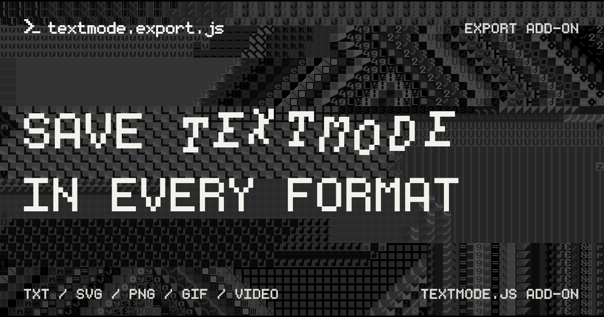

# textmode.export.js

|   |    |   |
| :---------------------------------------------------------------------------------------------------------------------------------------------------------------------------------------------------------------------------------- | :------------------------------------------------------------------------------------------------------------------------------------------------------------------------------------------------------------------------------------------------------------------------------------------------------------------------------------------------------------------------------------------------------------ | :-------------------------------------------------------------------------------------------------------------------------------------------------------------------------------------------------------------------------------------------------------- |

`textmode.export.js` is a free, lightweight export add-on for [`textmode.js`](https://github.com/humanbydefinition/textmode.js) that adds flexible output workflows. It supports plain text and JSON data, raster images, animated GIFs, WebM and MP4 video, and scalable vector graphics through a consistent browser-based API.

The add-on is designed to make saving and sharing textmode creations straightforward for developers and end users alike. Whether you need a single still image, structured document data, or a complete animation, `textmode.export.js` provides both programmatic controls and an optional overlay UI.

## Features

- **Six output families** - TXT, structured JSON, SVG, PNG/JPEG/WebP, animated GIF, and MP4/WebM video
- **Exact canvas capture** - Preserve the final presented result, including compositing, shaders, filters, and post-processing
- **Layer-aware documents** - Export selected layers to TXT/SVG/JSON or preserve the complete descriptive layer stack in JSON
- **Programmatic exports** - Return text, SVG, and JSON in memory or save them directly as files
- **Interactive overlay** - Built-in format controls, live layer selectors, runtime defaults, visibility controls, and remembered placement
- **Clipboard workflows** - Copy text, JSON, SVG, and raster output without downloading files
- **Controlled animation capture** - Configure frames, frame rate, scale, GIF repetition, video encoding, transparency, progress, and more

## Try it online first

Open [editor.textmode.art](https://editor.textmode.art/), a browser-based live-coding environment for the
complete official `textmode.js` ecosystem. Sketches run as you edit, with no local toolchain required.

The editor includes `textmode.js` and all four official add-ons: `textmode.export.js`, `textmode.filters.js`,
`textmode.figlet.js`, and `textmode.synth.js`.

- Write with Monaco-powered completions, hover documentation, and diagnostics.
- Start with a blank sketch, an included example, or a community gallery sketch.
- Keep code and preferences saved in the browser, then share sketches through URL-based links.
- Use microphone or line-input analysis for audio-reactive work, and create on desktop or mobile.

Use it to experiment with export functionality while your sketch is running.

## Installation

Follow the [official installation guide](https://code.textmode.art/docs/installation) to install
`textmode.export.js` alongside `textmode.js` with npm or browser-ready UMD bundles.

## Next steps

- **[Read the exporting documentation](https://code.textmode.art/docs/exporting.html)** for supported formats and workflows.
- **[Browse the API reference](https://code.textmode.art/api/textmode.export.js/)** for the complete typed API.
- **[Explore the examples](./examples/)** to see export plugins and options in action.
- **[Try the live editor](https://editor.textmode.art/)** to experiment with exports in the browser.

## Contributing

Thank you for considering contributing to this project! (✿◠‿◠)

Please read the [Contributing Guide](https://github.com/humanbydefinition/textmode.js-dev/blob/dev/CONTRIBUTING.md) to get started.

<!-- TEXTMODE-CONTRIBUTORS:START -->
<!-- prettier-ignore-start -->
<!-- Generated from https://github.com/humanbydefinition/code.textmode.art/blob/main/.vitepress/data/contributors.json and https://github.com/humanbydefinition/code.textmode.art/blob/main/.vitepress/data/contribution-types.json. Do not edit this section directly. -->
## Contributors

Thanks to the people who contribute code, documentation, design, examples, ideas, infrastructure, and care
across the textmode.js ecosystem.

<!-- markdownlint-disable MD033 -->
<table>
  <tbody>
    <tr>
      <td align="center" valign="top" width="14.28%">
        <a href="https://github.com/humanbydefinition">
          
           <b>humanbydefinition</b>
        </a>
         💻 📖 🎨 💡 🤔 🚧 🚇 🔧 🔌 👀
      </td>
      <td align="center" valign="top" width="14.28%">
        <a href="https://github.com/trintlermint">
          
           <b>trintlermint</b>
        </a>
         🎨 💡
      </td>
    </tr>
  </tbody>
</table>
<!-- markdownlint-enable MD033 -->

Contribution details and profile links are maintained on the [textmode.js contributors page](https://code.textmode.art/docs/contributors).
<!-- prettier-ignore-end -->
<!-- TEXTMODE-CONTRIBUTORS:END -->

## License

`textmode.export.js` is licensed under the [MIT License](./LICENSE).

## Acknowledgements

- **[mediabunny](https://github.com/Vanilagy/mediabunny)**
  - WebM and MP4 video export support via WebCodecs, by [Vanilagy](https://github.com/Vanilagy).
  - License: [MPL-2.0](https://github.com/Vanilagy/mediabunny/blob/main/LICENSE).

- **[gifenc](https://github.com/mattdesl/gifenc)**
  - Animated GIF encoding by [Matt DesLauriers](https://github.com/mattdesl).
  - License: [MIT License](https://github.com/mattdesl/gifenc/blob/main/LICENSE.md).

---

 

**[↑ back to top](#textmodeexportjs)**

